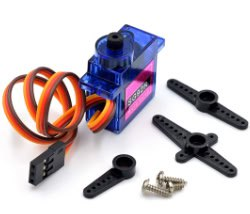
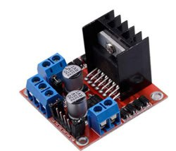

# 3ID - Future Engineer 
## Performance Video in National Round (Cambodia)
Open Round Video: **https://youtube.com/shorts/tUXS3P6ZWww**

Obstacle Round Video: **https://youtube.com/shorts/n_JYVOY8L6s**
## Team Members
* Chea Vitou, 6023010001@camtech.edu.kh
* Saroeun Norakvitou, 6023030003@camtech.edu.kh
* Visal Phumint, Phumint1969@gmail.com 
## Coach
* Sea Sokchamroeun, 6023010027@camtech.edu.kh
---
# Hardware
<table>
  <tr>
    <td align="center" style="vertical-align: top;">
      
       
      Robot Iso View
    </td>
    <td align="center" style="vertical-align: top;">
      
       
      Robot Bottom View
    </td>
    <td align="center" style="vertical-align: top;">
      
       
      Robot Top View
    </td>
  </tr>
</table>

## Mobility Management - Rear-wheel drive system with Ackermann steering

+ Drivetrain: The robot uses a rear-wheel drive system powered by a single geared DC motor.
+ Differential: Power is transmitted through a central differential gearbox to the rear wheels, allowing them to spin at different speeds during turns.
+ Steering: An Ackermann steering system, actuated by a single hobby servo, controls the front wheels.
+ Motion: This combination mimics car-like motion for smooth, precise turns and reduced tire slip.
+ Chassis: The chassis is a custom 3D-printed structure designed for optimal stability, weight distribution, and component mounting.
+ Documentation: The project documentation covers motor selection, implementation, chassis design, engineering principles (speed, torque, power), assembly instructions, and includes references to 3D CAD files.

<table>
  <tr>
    <td align="center" style="vertical-align: top;">
      
       
      Ackerman Steering Mechanism
    </td>
    <td align="center" style="vertical-align: top;">
      
       
      Differential Gearbox
    </td>
  </tr>
</table>

## Chassis Design and Selection

The chassis is a custom 3D-printed structure, designed to support the Ackerman steering and differential drive system. It is lightweight yet rigid, using PLA and most part and ABS on parts that require durability.

Google Drive Link to CAD Models and Parts STLS: https://drive.google.com/drive/folders/1KM2BjuHMXqjhYWxJgh39tXH3upUK1R4r

## Motor Selection and Implementation

### Motor Selection

#### Motor Type:

- **25GA370 gear motor** with integrated encoder

#### Specifications:

- **Voltage:** 12 V (compatible with an 11.1V 3S LiPo battery)  
- **No-Load Speed:** 280 RPM  
- **Gear Ratio:** 1:60 (motor rotates 60 times for one wheel rotation)  
- **Torque:** High torque output (exact value depends on model, typically ~1–2 Nm for 25GA370 at 12V)
- **Encoder:** Incremental encoder for speed and position feedback  

#### Rationale for Selection:

- **High Torque:** The 1:60 gear ratio provides sufficient torque for driving the robot, especially for overcoming friction and navigating inclines or uneven surfaces.
- **Encoder Feedback:** Enables closed-loop control, allowing precise speed regulation and distance tracking via the Raspberry Pi.
- **Availability:** Sourced from lab storage, reducing project costs.  
- **Compatibility:** Matches the 11.1 V LiPo battery voltage and integrates seamlessly with the L298N motor driver.  

#### Steering Servo:

- **Type:** 9g micro servo  
- **Specifications:** Operates at 5–6V, torque ~1.8 kg·cm, lightweight (9g) 
- **Rationale for Selection:**
  - **Precision:** Provides accurate control of steering angles for Ackerman geometry.  
  - **Lightweight:** Minimizes weight impact on the chassis.  
  - **Power Efficiency:** Low power consumption suits the buck converter’s 5V output.  
  - **Availability:** Readily available in lab storage.  

---

### Motor Implementation

- **Drive System:** The 25GA370 motor powers a differential drive system, adapted to support Ackerman steering geometry. The motor drives two wheels through a differential gearbox (1:60 ratio), reducing the output speed to approximately 4.67 RPM (280 ÷ 60) at the wheels, increasing torque for effective propulsion.
- **Control:** The L298N motor driver, connected to the Raspberry Pi 4, uses Pulse Width Modulation (PWM) to control motor speed and direction. The encoder provides feedback to the Raspberry Pi, enabling closed-loop control for precise speed and position adjustments.
- **Steering:** The 9g servo adjusts the steering angle of the front wheels based on Ackerman principles, where each wheel follows a different turning radius to minimize slippage and ensure smooth turns. The servo is controlled via PWM signals from the Raspberry Pi’s GPIO pins.
- **Power Supply:**  
  - The motor and L298N driver are powered directly from the 11.1V LiPo battery, as the motor’s 12V requirement is within the battery’s nominal voltage range.
  - The servo is powered by a buck converter stepping down the 11.1V battery to 5V (or 6V, depending on servo specifications), shared with the Raspberry Pi.

---

## Key Features

- Mounting Points: Includes dedicated slots or holes for the Raspberry Pi 4, L298N motor driver, 11.1 V LiPo battery, 9 g servo, and camera.  
- Weight Distribution: The battery is centrally mounted to lower the center of gravity, enhancing stability during turns. The camera is positioned at the front for an unobstructed field of view.  
- Ackerman Geometry Support: The chassis accommodates pivot points for the front wheels, ensuring proper alignment for Ackerman steering.  
- Modularity: Designed for easy assembly and maintenance, with accessible mounting points for screws and brackets.  

## Rationale for Selection

- Customizability: 3D printing allows tailoring the chassis to fit all components precisely, optimizing space and weight.  
- Cost-Effectiveness: Utilizes lab resources (3D printer and filament) to avoid purchasing a commercial chassis.  
- Stability: The design ensures a low center of gravity and balanced weight distribution, critical for Ackerman steering and differential drive.  
## Power and Sense Management Overview

The autonomous robot is designed to navigate various challenges using a Raspberry Pi 4B as the central processing unit, powered by a 3S LiPo battery (11.1 V, 2200 mAh). The system integrates a camera for vision-based navigation, a DC motor with an encoder for locomotion, a servo for actuation, and a motor driver for motor control. A buck converter steps down the battery voltage to meet the power requirements of various components. This section details the power distribution, sensor selection, their integration, and power consumption considerations, along with a professional wiring diagram and Bill of Materials (BOM).

---

## Power Management

The power system is designed to efficiently distribute power from a single 3S LiPo battery (11.1 V, 2200 mAh) to all components while ensuring voltage compatibility and minimizing power loss. The key components and their power requirements are:

- Raspberry Pi 4B: Requires 5 V at 3 A for stable operation. Powered via a buck converter to step down the 11.1 V battery voltage to 5 V.  
- Servo: Operates at 6 V, typically drawing 0.5–1 A under load. Powered through the same buck converter with an adjusted output or a separate regulator to provide 6 V.  
- DC Motor and Motor Driver: Requires 12 V, with the motor driver handling currents up to 5 A (depending on load). Directly powered from the 11.1 V battery, as it is within the operational range of the motor driver.  
- Camera: Operates at 5 V, drawing 160–260 mA. Powered directly from the Raspberry Pi’s USB port, leveraging the Pi’s 5 V rail.  
- Button: A simple push-button switch for power control or emergency stop, negligible power consumption.  

---

## Power Distribution

A buck converter is used to step down the 11.1 V battery voltage to 5 V and 6 V to meet the requirements of the Raspberry Pi and servo, respectively. The motor driver and DC motor are powered directly from the battery, as their voltage requirements align closely with the 11.1 V nominal voltage of the 3S LiPo battery. To ensure safety and efficiency:

- The buck converter is selected for high efficiency (> 90 %) to minimize energy loss.  
- A fuse (e.g., 10 A) is included at the battery output to protect against short circuits or overcurrent conditions.  
- Proper wire gauges (e.g., AWG 18 for high-current paths to the motor driver, AWG 22 for low-current paths like the camera) are used to minimize voltage drops and heat generation.  

---

## Power Consumption Estimate

- Raspberry Pi 4B: 5 V × 3 A = 15 W (peak).  
- Servo: 6 V × 1 A = 6 W (under load).  
- DC Motor and Driver: 11.1 V × 5 A = 55.5 W (peak, assuming high load).  
- Camera: 5 V × 0.26 A = 1.3 W (maximum).  
- Total Peak Power: ~ 77.8 W.  
- Battery Runtime: With a 2200 mAh (24.42 Wh) battery, the theoretical runtime at peak load is approximately 24.42 Wh ÷ 77.8 W ≈ 0.31 hours (18.8 minutes). In practice, the average power consumption is lower (e.g., 30–40 W), extending runtime to ~ 30–45 minutes.  

---

## Sensor Selection and Usage

The robot relies primarily on a camera for environmental sensing, with an attempted integration of a LiDAR module that was ultimately abandoned due to integration challenges.

### Camera

- Type: USB camera (Operating Voltage: 5 V, Current: 160–260 mA).  
- Purpose: Provides visual data for navigation, obstacle detection, and path planning.  
- Rationale for Selection:  
  - Cost-Effectiveness: Available in lab storage, reducing project costs.  
  - Compatibility: Easily interfaces with the Raspberry Pi via USB, leveraging libraries like OpenCV for image processing.  
  - Versatility: Capable of detecting obstacles, recognizing patterns, or following lines, depending on the software implementation.  
- Usage: The camera captures real-time video or images, which are processed by the Raspberry Pi to detect obstacles, navigate paths, or identify specific targets (e.g., markers or objects). The power draw is minimal, and the USB connection simplifies wiring and data transfer.  

### Attempted LiDAR Integration

- Type: Repurposed Cleaning Robot LiDAR module, interfaced via an ESP32.  
- Purpose: Intended for precise distance mapping and obstacle avoidance.  
- Challenges:  
  - Lack of an LDS2USB adapter, requiring custom interfacing with an ESP32.  
  - Inaccurate sensor data due to hard-coded implementation, leading to unreliable performance.  
  - High development time and complexity outweighed benefits given the camera’s sufficiency for basic navigation.  
- Outcome: The LiDAR was abandoned in favor of the camera, which provided adequate sensing for the robot’s requirements within the project’s constraints.  

### DC Motor Encoder

- Type: Incremental encoder attached to the DC motor.  
- Purpose: Provides feedback on motor speed and position for precise control.  
- Rationale for Selection:  
  - Available in lab storage, reducing costs.  
  - Enables closed-loop control, improving navigation accuracy (e.g., maintaining consistent speed or distance traveled).  
- Usage: The encoder sends pulse signals to the Raspberry Pi (via GPIO or the motor driver’s interface), allowing the system to monitor wheel rotation and adjust motor commands for accurate movement.  

---

## Wiring Diagram

The wiring diagram illustrates the power and signal connections between components, ensuring clarity and professionalism. Key features include:

- Color Coding: Red for positive power lines, black for ground, and other colors (e.g., blue, yellow) for signal lines.  
- Connectors: JST or XT60 connectors for high-current paths (battery to motor driver), and pin headers for low-current signal connections.  
- Labels: Each wire and component is labeled for easy identification.  
- Safety Features: A fuse at the battery output and proper grounding to prevent electrical issues.  

---

## Bill of Materials (BOM)

The BOM lists all components used in the power and sense management system, sourced from lab storage.  

## Components On Robot

| Itemized Expenses                                         | Picture                                                                                              | Unit Price | Quantity | Description                                                    | Subtotal   |
|-----------------------------------------------------------|------------------------------------------------------------------------------------------------------|------------|----------|----------------------------------------------------------------|------------|
| 1. LM2596S 3A buck module                                 |                                               | $1.50      | 1 pcs    | Steps down 11.1 V to 5 V/6 V, 5 A capacity                      | $1.50      |
| 2. JGB37-520 encoder gear motor (530 RPM)                 |                                                        | $8.00      | 1 pcs    | DC motor with incremental encoder                              | $8.00      |
| 3. MG90S servo motor (90–180°)                            |                                                                | $1.50      | 1 pcs    | Actuator for mechanical tasks                                  | $4.50      |
| 4. Raspberry Pi 4                                         |                                                           | $75.00     | 1 pcs    | Central processing unit                                        | $75.00     |
| 5. L298N motor driver module                              |                                                              | $1.50      | 1 pcs    | Controls DC motor, supports encoder input                      | $1.50      |
| 6. 3S LiPo Battery 25C (11.1 V, 2200 mAh)                 |                                                        | $23.00     | 1 pcs    | High-capacity LiPo battery                                     | $23.00     |
| 7. 8 MP Autofocus USB 2.0 Camera                          |                                                          | $40.00     | 1 pcs    | Vision sensor for navigation                                   | $40.00     |
| **Total**                                                 |                                                                                                      |            |          |                                                                | **$153.50** |
