# 3ID - Future Engineer 
## Performance Video in National Round (Cambodia)
Open Round Video: **https://youtube.com/shorts/tUXS3P6ZWww**

Obstacle Round Video: **https://youtube.com/shorts/n_JYVOY8L6s**
## Team Members
* Chea Vitou, 6023010001@camtech.edu.kh
* Saroeun Norakvitou, 6023030003@camtech.edu.kh
* Visal Phumint, Phumint1969@gmail.com 
## Coach
* Sea Sokchamroeun, 6023010027@camtech.edu.kh
---
# Hardware
<table>
  <tr>
    <td align="center" style="vertical-align: top;">
      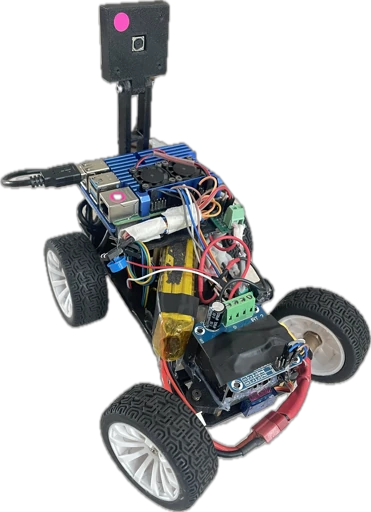
      <br>
      Robot Iso View
    </td>
    <td align="center" style="vertical-align: top;">
      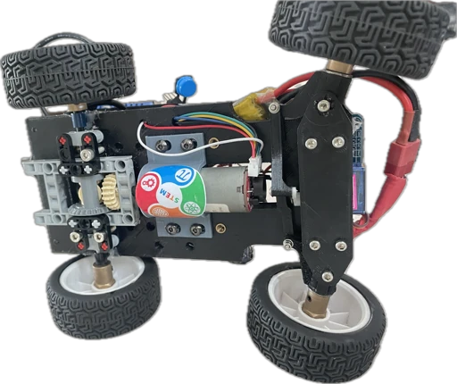
      <br>
      Robot Bottom View
    </td>
    <td align="center" style="vertical-align: top;">
      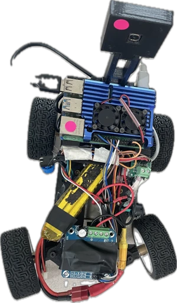
      <br>
      Robot Top View
    </td>
  </tr>
</table>

## Mobility Management - Rear-wheel drive system with Ackermann steering

+ **Drivetrain**: The robot uses a rear-wheel drive system powered by a single geared DC motor.
+ **Differential**: Power is transmitted through a central differential gearbox to the rear wheels, allowing them to spin at different speeds during turns.
+ **Steering**: An Ackermann steering system, actuated by a single hobby servo, controls the front wheels.
+ **Motion**: This combination mimics car-like motion for smooth, precise turns and reduced tire slip.
+ **Chassis**: The chassis is a custom 3D-printed structure designed for optimal stability, weight distribution, and component mounting.

<table>
  <tr>
    <td align="center" style="vertical-align: top;">
      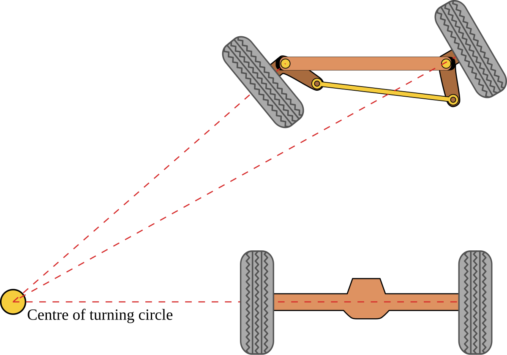
      <br>
      Ackerman Steering Mechanism
    </td>
    <td align="center" style="vertical-align: top;">
      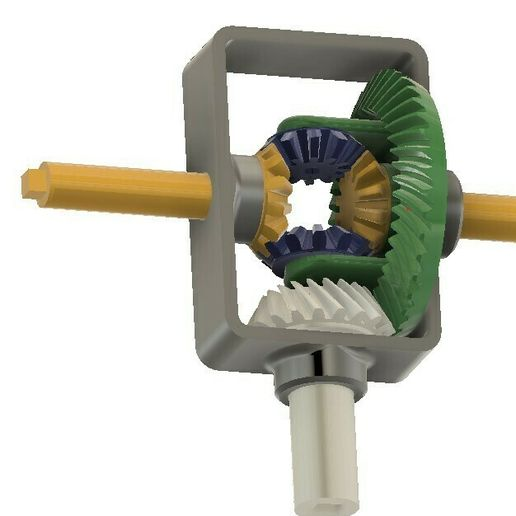
      <br>
      Differential Gearbox
    </td>
  </tr>
</table>

## Chassis Design and Selection - 3D Printing

The chassis is a custom 3D-printed structure, designed to support the Ackerman steering and differential drive system. It is lightweight yet rigid. 
The chassis and parts are printed mostly with PLA  but parts that require high durability, like motor shaft, are printed with ABS.

Google Drive Link to CAD Models and Parts STLS: https://drive.google.com/drive/folders/1KM2BjuHMXqjhYWxJgh39tXH3upUK1R4r

## Component Selection
+ **Microprocessor**: Raspberry Pi4
  * This is a powerful, low-cost computer perfect for running the robot's control system and processing camera data for tasks like object detection.
+ **Rear Drive**: JGB37-520 encoder gear motor
  * The motor's gearbox provides the torque needed to move the robot. Though not used for this project at the moment, the encoder allows for precise speed and position control.
+ **Steering**: SG92R Steering Servo Motor
  * This small, affordable servo provides the precise angular control required for the Ackermann steering mechanism. Initially we used the infamous sg90s but the plastic gear broke so we switched to a more durable servo.
+ **Sensor**: 8 MP Autofocus USB 2.0 Camera
  * The high-resolution camera with autofocus is ideal for computer vision tasks, such as navigation and object recognition. However, **this camera FOV is too narrow**, limiting robot's capabilities in obstacle maneuvering :cry:.

<table>
  <tr>
    <td align="center" style="vertical-align: top;">
      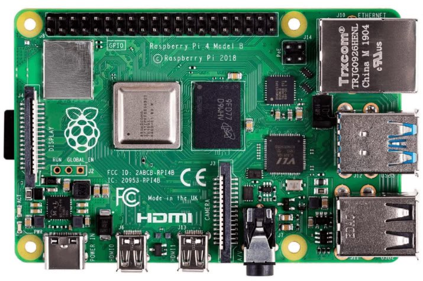
      <br>
      Raspberry Pi 4
    </td>
    <td align="center" style="vertical-align: top;">
      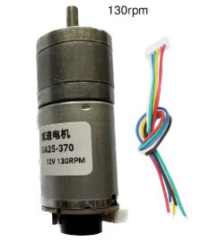
      <br>
      JGB37-520 encoder gear motor
    </td>
    <td align="center" style="vertical-align: top;">
      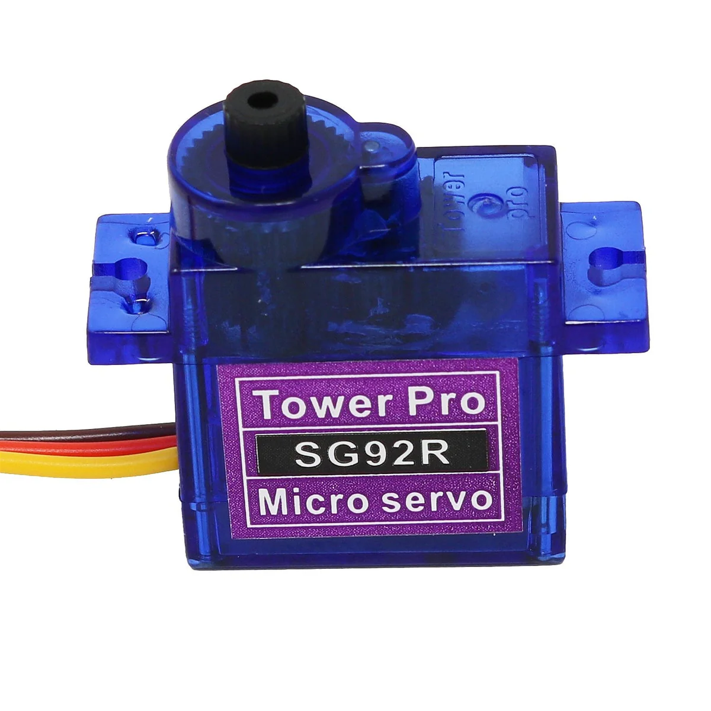
      <br>
      SG92R Steering Servo Motor
    </td>
    <td align="center" style="vertical-align: top;">
      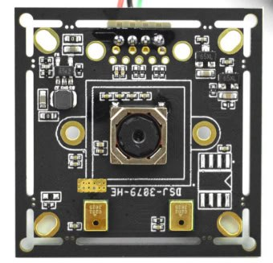
      <br>
       8 MP Autofocus USB 2.0 Camera
    </td>
  </tr>
</table>

## Electrical Components

+ **Main Power Source**: 3S LiPo Battery
  * A 3S LiPo battery provides a nominal voltage of 11.1 V (3 cells in series) and a capacity of 2200 mAh. Its high C-rating of 25C allows it to safely deliver a high current (up to 55A), which is necessary for the motor's peak power demands without damaging the battery.
+ **Voltage Regulation**: LM2596S Buck Converter
  * The LM2596S buck converter efficiently steps down the 11.1 V from the LiPo battery to the required voltage for the Raspberry Pi and other low-power electronics, such as the servo. With a 3A output, it provides a stable power supply, preventing damage to sensitive components from over-voltage.
+ **Motor Driver**: BTS7960 Driver
  * The BTS7960 driver is used to control the DC motor. We initally used the infamous L298N motor driver but because it features a big voltage drop of 2V, we decided to go with the BTS.

<table>
  <tr>
    <td align="center" style="vertical-align: top;">
      
      <br>
      3S LiPo Battery
    </td>
    <td align="center" style="vertical-align: top;">
      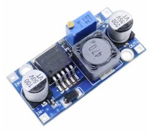
      <br>
      LM2596S Buck Converter
    </td>
    <td align="center" style="vertical-align: top;">
      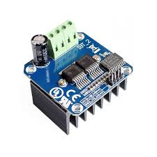
      <br>
      BTS7960 Motor Driver
    </td>
  </tr>
</table>

## Power Management and Distribution

<table>
  <tr>
    <td align="center" style="vertical-align: top;">
      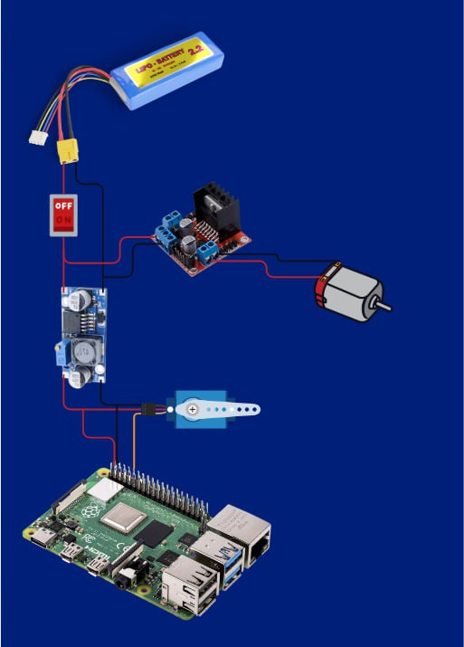
      <br>
      Simple Wiring Diagram
    </td>
  </tr>
</table>

The robot's power system uses a 3S LiPo battery (11.1 V, 2200 mAh) as the main power source. This single battery efficiently powers all components.

+ **Motor and Driver**: The JGB37-520 motor is powered directly by the 11.1 V battery. The BTS7960 motor driver can handle this voltage without issue, providing ample power to the drive system.
+ **Electronics (Raspberry Pi & Servo)**: The buck converter steps down the 11.1 V battery voltage to power the electronics with 5V.
+ **Raspberry Pi 4**: The buck converter is wired to a USB-C cable to power the Pi, which is a more stable method than using the 5V GPIO pin.
+ **Servo**: The SG92R servo operates at 5V and is also powered by the buck converter.
+ **Camera**: The USB camera is powered directly through the Raspberry Pi's USB port, drawing its power from the Pi's regulated 5V rail.

This design ensures all components receive the correct voltage while minimizing the number of batteries required.

---

# Software

**Both open and obstacle round uses the same script.** The script contains wall following for the open round and a pillar avoidance state when conditions are met. Both tasks utilizes PD controller for target servo angle and the rear motor spins at a constant speed.  

## Main Control Loop Overview:

+ Acquire a frame → blur → convert to HSV.
+ Attempt **pillar-following** first:
1. Detect red/green masks → contours → choose the closest valid pillar based on its bottom y.
2. If found, compute PD steering to align pillar to its target x (left for red, right for green).
+ If no pillar, fall back to **wall-following**:
* Detect drivable boundary (“wall”) in left/right bottom ROIs, compare max contour areas to keep centered.
+ **Progress tracking** via the mid ROI:
 Watch for sequence Orange → Blue, then count once both have been seen and subsequently cleared.
+ **Stop condition**: when the encoder count reaches a threshold, cut motor and exit.
+ Repeat until stop or error; then clean up resources.

``` ruby
LOOP forever:
    READ frame from camera
    IF no frame → EXIT loop

    PREPROCESS frame:
       - Apply Gaussian blur
       - Convert to HSV color space

    DETECT pillars (Red/Green)
    IF a valid pillar exists:
        ENTER Pillar Following Mode
    ELSE:
        ENTER Wall Following Mode

    CHECK mid ROI for Orange/Blue markers
    UPDATE virtual encoder count

    IF encoder_count >= 13:
        STOP motor
        BREAK loop

```

## Pillar Following and Avoiding Mode

The robot uses visual servoing: it measures how far the pillar is from the desired position, and uses a PD controller to adjust its steering angle. Smoothing makes the robot’s movement less jerky.

```ruby
IF closest pillar detected:
    # Step 1: Define where the pillar *should* appear
    IF pillar_color == "red":
        target_x = 10              # near left edge
    ELSE IF pillar_color == "green":
        target_x = 630             # near right edge

    # Step 2: Calculate error (how far pillar is from target position)
    error = pillar_x - target_x
    derivative = error - prev_error_pillar

    # Step 3: PD control to turn towards target
    angle_cmd = -(KP_PILLAR * error + KD_PILLAR * derivative)

    # Step 4: Limit angle to servo range
    angle_cmd = CLAMP(angle_cmd, SERVO_MIN, SERVO_MAX)

    # Step 5: Smooth response (avoid sudden jumps)
    smoothed_angle = alpha*angle_cmd + (1 - alpha)*prev_angle

    # Step 6: Send steering command
    SET servo = smoothed_angle

    # Step 7: Update memory for next iteration
    prev_error_pillar = error
    prev_angle = smoothed_angle

```

## Wall Following mode

If the robot sees more wall on the right, it assumes it is drifting too close to the right side → so it steers left. Vice versa for the left. The PD controller makes this correction smooth and stable.

```ruby
IF no pillar detected:
    # Step 1: Measure wall "strength" on left and right
    left_area  = max_contour_area(left_ROI)
    right_area = max_contour_area(right_ROI)

    # Step 2: Compute balance error
    error = right_area - left_area
    derivative = error - prev_error_wall

    # Step 3: PD control to balance wall areas
    angle_cmd = KP_WALL * error + KD_WALL * derivative

    # Step 4: Limit to servo range
    angle_cmd = CLAMP(angle_cmd, SERVO_MIN, SERVO_MAX)

    # Step 5: Apply steering
    SET servo = angle_cmd

    # Step 6: Update memory
    prev_error_wall = error

```

## Bill of Materials (BOM)

The BOM lists all components used in the mobile robot.  

## Components On Robot

| Itemized Expenses                                         | Picture                                                                                              | Unit Price | Quantity | Description                                                    | Subtotal   |
|-----------------------------------------------------------|------------------------------------------------------------------------------------------------------|------------|----------|----------------------------------------------------------------|------------|
| 1. LM2596S 3A buck module                                 |                                               | $1.50      | 1 pcs    | Steps down 11.1 V to 5 V/6 V, 5 A capacity                      | $1.50      |
| 2. JGB37-520 encoder gear motor (530 RPM)                 |                                                        | $8.00      | 1 pcs    | DC motor with incremental encoder                              | $8.00      |
| 3. SG92R Steering Servo Motor                            |                                                                | $2.00      | 1 pcs    | Actuator for mechanical tasks                                  | $2.00      |
| 4. Raspberry Pi 4                                         |                                                           | $75.00     | 1 pcs    | Central processing unit                                        | $75.00     |
| 5. BTS7960 Driver                              |                                                              | $4.00      | 1 pcs    | Controls DC motor, supports encoder input                      | $4.00      |
| 6. 3S LiPo Battery 25C (11.1 V, 2200 mAh)                 |                                                        | $23.00     | 1 pcs    | High-capacity LiPo battery                                     | $23.00     |
| 7. 8 MP Autofocus USB 2.0 Camera                          |                                                          | $40.00     | 1 pcs    | Vision sensor for navigation                                   | $40.00     |
| **Total**                                                 |                                                                                                      |            |          |                                                                | **$153.50** |
