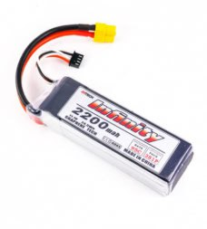

# 3ID - Future Engineer 
## Performance Video in National Round (Cambodia)
Open Round Video: **https://youtube.com/shorts/tUXS3P6ZWww**

Obstacle Round Video: **https://youtube.com/shorts/n_JYVOY8L6s**
## Team Members
* Chea Vitou, 6023010001@camtech.edu.kh
* Saroeun Norakvitou, 6023030003@camtech.edu.kh
* Visal Phumint, Phumint1969@gmail.com 
## Coach
* Sea Sokchamroeun, 6023010027@camtech.edu.kh
---
# Hardware
<table>
  <tr>
    <td align="center" style="vertical-align: top;">
      
       
      Robot Iso View
    </td>
    <td align="center" style="vertical-align: top;">
      
       
      Robot Bottom View
    </td>
    <td align="center" style="vertical-align: top;">
      
       
      Robot Top View
    </td>
  </tr>
</table>

## Mobility Management - Rear-wheel drive system with Ackermann steering

+ **Drivetrain**: The robot uses a rear-wheel drive system powered by a single geared DC motor.
+ **Differential**: Power is transmitted through a central differential gearbox to the rear wheels, allowing them to spin at different speeds during turns.
+ **Steering**: An Ackermann steering system, actuated by a single hobby servo, controls the front wheels.
+ **Motion**: This combination mimics car-like motion for smooth, precise turns and reduced tire slip.
+ **Chassis**: The chassis is a custom 3D-printed structure designed for optimal stability, weight distribution, and component mounting.

<table>
  <tr>
    <td align="center" style="vertical-align: top;">
      
       
      Ackerman Steering Mechanism
    </td>
    <td align="center" style="vertical-align: top;">
      
       
      Differential Gearbox
    </td>
  </tr>
</table>

## Chassis Design and Selection - 3D Printing

The chassis is a custom 3D-printed structure, designed to support the Ackerman steering and differential drive system. It is lightweight yet rigid. 
The chassis and parts are printed mostly with PLA  but parts that require high durability, like motor shaft, are printed with ABS.

Google Drive Link to CAD Models and Parts STLS: https://drive.google.com/drive/folders/1KM2BjuHMXqjhYWxJgh39tXH3upUK1R4r

## Component Selection
+ **Microprocessor**: Raspberry Pi4
  * This is a powerful, low-cost computer perfect for running the robot's control system and processing camera data for tasks like object detection.
+ **Rear Drive**: JGB37-520 encoder gear motor
  * The motor's gearbox provides the torque needed to move the robot. Though not used for this project at the moment, the encoder allows for precise speed and position control.
+ **Steering**: SG92R Steering Servo Motor
  * This small, affordable servo provides the precise angular control required for the Ackermann steering mechanism. Initially we used the infamous sg90s but the plastic gear broke so we switched to a more durable servo.
+ **Sensor**: 8 MP Autofocus USB 2.0 Camera
  * The high-resolution camera with autofocus is ideal for computer vision tasks, such as navigation and object recognition. However, **this camera FOV is too narrow**, limiting robot's capabilities in obstacle maneuvering :(.

<table>
  <tr>
    <td align="center" style="vertical-align: top;">
      
       
      Raspberry Pi 4
    </td>
    <td align="center" style="vertical-align: top;">
      
       
      JGB37-520 encoder gear motor
    </td>
    <td align="center" style="vertical-align: top;">
      
       
      SG92R Steering Servo Motor
    </td>
    <td align="center" style="vertical-align: top;">
      
       
       8 MP Autofocus USB 2.0 Camera
    </td>
  </tr>
</table>

## Electrical Components

+ **Main Power Source**: 3S LiPo Battery
  * A 3S LiPo battery provides a nominal voltage of 11.1 V (3 cells in series) and a capacity of 2200 mAh. Its high C-rating of 25C allows it to safely deliver a high current (up to 55A), which is necessary for the motor's peak power demands without damaging the battery.
+ **Voltage Regulation**: LM2596S Buck Converter
  * The LM2596S buck converter efficiently steps down the 11.1 V from the LiPo battery to the required voltage for the Raspberry Pi and other low-power electronics, such as the servo. With a 3A output, it provides a stable power supply, preventing damage to sensitive components from over-voltage.
+ **Motor Driver**: BTS7960 Driver
  * The BTS7960 driver is used to control the DC motor. We initally used the infamous L298N motor driver but because it features a big voltage drop of 2V, we decided to go with the BTS.

<table>
  <tr>
    <td align="center" style="vertical-align: top;">
      
       
      3S LiPo Battery
    </td>
    <td align="center" style="vertical-align: top;">
      
       
      LM2596S Buck Converter
    </td>
    <td align="center" style="vertical-align: top;">
      
       
      BTS7960 Motor Driver
    </td>
  </tr>
</table>

## Power Management and Distribution

<table>
  <tr>
    <td align="center" style="vertical-align: top;">
      
       
      Simple Wiring Diagram
    </td>
  </tr>
</table>

The robot's power system uses a 3S LiPo battery (11.1 V, 2200 mAh) as the main power source. This single battery efficiently powers all components.

+ **Motor and Driver**: The JGB37-520 motor is powered directly by the 11.1 V battery. The BTS7960 motor driver can handle this voltage without issue, providing ample power to the drive system.
+ **Electronics (Raspberry Pi & Servo)**: The buck converter steps down the 11.1 V battery voltage to power the electronics with 5V.
+ **Raspberry Pi 4**: The buck converter is wired to a USB-C cable to power the Pi, which is a more stable method than using the 5V GPIO pin.
+ **Servo**: The SG92R servo operates at 5V and is also powered by the buck converter.
+ **Camera**: The USB camera is powered directly through the Raspberry Pi's USB port, drawing its power from the Pi's regulated 5V rail.

This design ensures all components receive the correct voltage while minimizing the number of batteries required.

## Power Distribution

A buck converter is used to step down the 11.1 V battery voltage to 5 V and 6 V to meet the requirements of the Raspberry Pi and servo, respectively. The motor driver and DC motor are powered directly from the battery, as their voltage requirements align closely with the 11.1 V nominal voltage of the 3S LiPo battery. To ensure safety and efficiency:

- The buck converter is selected for high efficiency (> 90 %) to minimize energy loss.  
- A fuse (e.g., 10 A) is included at the battery output to protect against short circuits or overcurrent conditions.  
- Proper wire gauges (e.g., AWG 18 for high-current paths to the motor driver, AWG 22 for low-current paths like the camera) are used to minimize voltage drops and heat generation.  

---

# Software

## Open Round Challenge

## Obstacle Challenge

## Sensor Selection and Usage

The robot relies primarily on a camera for environmental sensing, with an attempted integration of a LiDAR module that was ultimately abandoned due to integration challenges.

### Camera

- Type: USB camera (Operating Voltage: 5 V, Current: 160–260 mA).  
- Purpose: Provides visual data for navigation, obstacle detection, and path planning.  
- Rationale for Selection:  
  - Cost-Effectiveness: Available in lab storage, reducing project costs.  
  - Compatibility: Easily interfaces with the Raspberry Pi via USB, leveraging libraries like OpenCV for image processing.  
  - Versatility: Capable of detecting obstacles, recognizing patterns, or following lines, depending on the software implementation.  
- Usage: The camera captures real-time video or images, which are processed by the Raspberry Pi to detect obstacles, navigate paths, or identify specific targets (e.g., markers or objects). The power draw is minimal, and the USB connection simplifies wiring and data transfer.  

### Attempted LiDAR Integration

- Type: Repurposed Cleaning Robot LiDAR module, interfaced via an ESP32.  
- Purpose: Intended for precise distance mapping and obstacle avoidance.  
- Challenges:  
  - Lack of an LDS2USB adapter, requiring custom interfacing with an ESP32.  
  - Inaccurate sensor data due to hard-coded implementation, leading to unreliable performance.  
  - High development time and complexity outweighed benefits given the camera’s sufficiency for basic navigation.  
- Outcome: The LiDAR was abandoned in favor of the camera, which provided adequate sensing for the robot’s requirements within the project’s constraints.  

## Bill of Materials (BOM)

The BOM lists all components used in the power and sense management system, sourced from lab storage.  

## Components On Robot

| Itemized Expenses                                         | Picture                                                                                              | Unit Price | Quantity | Description                                                    | Subtotal   |
|-----------------------------------------------------------|------------------------------------------------------------------------------------------------------|------------|----------|----------------------------------------------------------------|------------|
| 1. LM2596S 3A buck module                                 |                                               | $1.50      | 1 pcs    | Steps down 11.1 V to 5 V/6 V, 5 A capacity                      | $1.50      |
| 2. JGB37-520 encoder gear motor (530 RPM)                 |                                                        | $8.00      | 1 pcs    | DC motor with incremental encoder                              | $8.00      |
| 3. SG92R Steering Servo Motor                            |                                                                | $2.00      | 1 pcs    | Actuator for mechanical tasks                                  | $2.00      |
| 4. Raspberry Pi 4                                         |                                                           | $75.00     | 1 pcs    | Central processing unit                                        | $75.00     |
| 5. BTS7960 Driver                              |                                                              | $4.00      | 1 pcs    | Controls DC motor, supports encoder input                      | $4.00      |
| 6. 3S LiPo Battery 25C (11.1 V, 2200 mAh)                 |                                                        | $23.00     | 1 pcs    | High-capacity LiPo battery                                     | $23.00     |
| 7. 8 MP Autofocus USB 2.0 Camera                          |                                                          | $40.00     | 1 pcs    | Vision sensor for navigation                                   | $40.00     |
| **Total**                                                 |                                                                                                      |            |          |                                                                | **$153.50** |
